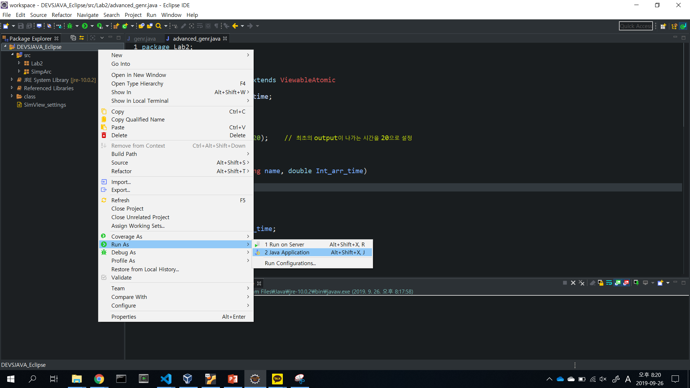

# 실습 2

## DEVS : Discrete-Event System Modeler and Simulator

- DEVS는 이산 사건이 발생하는 시스템을 모델링하고 시뮬레이션해주는 프로그램이다.
- DEVSJAVA Package는
  - Discrete-Event System을 모델링하고 시뮬레이션한다.
  - 계층적 방법과 Modular 기반으로 모델링을 한다.
  - Plug-in approach

## Atomic Model

DEVS에서는 쪼개지지 않고 가장 기본이 되는 모델을 **Atomic Model**이라고 한다. 이러한 Atomic Model 중 Generator(`genr.java`)가 존재한다.

> Tracjectory란 어떤 model에 대한 input과 model의 state, model의 output에 대한 시간의 그래프를 한번에 나타낸 형태의 그림이다.

모든 Atomic Model에는 다음 4가지 함수가 존재한다.

### External Transition Function

- 외부 이벤트(event)를 다룬다.
- internal에서 하지 않은일을 다룬다.
- phase와 sigma를 통해 스케줄링을 한다.

### Internal Transition Function

- 내부 이벤트(event)를 다룬다.
- 역시 phase와 sigma를 통해 스케줄링 한다.

### Output Function

- Internal Tansition이 발생한 시점에 외부 Output을 생성한다.

### Initialize Function

- 모델의 초기화를 담당하는 함수.

- 최초에 Initialize Fuction이 초기화를 진행한다.
- 그 다음 Output Function에 이동한다. Output Function은 메시지를 보내는 역할을 한다.
- Output Function에서 Internal Transition Funciton으로 이동한다. 여기서 내부적 일을 처리한다.
- 다시 Output Function으로 메시지를 보내 이동한다.
- Output Function와 Internal Transition Function이 계속 반복된다.
- External Function은 외부 이벤트에 대한 처리를 담당한다.

## 이클립스에 DEVS 프로젝트 생성 및 실행

- 프로젝트 생성  
  
새로 Lab2라는 패키지 생성 후 이곳에 genr.java와 advanced_genr.java(과제 파일) 파일 작성

- 프로젝트 실행  
  
프로젝트 폴더 우클릭 -> Run as -> Java application 선택

- configure 작성  
  
프로젝트를 실행시킨 뒤, 좌상단 configure 버튼 클릭 -> Model package names에 Lab2 입력 후 ok클릭

- package 선택  
  
package 선택에서 Lab2 선택

- advanced_genr 모델 선택  
  
모델 선택 메뉴에서 advanced_genr 선택

이후 중앙 아래에 step 버튼을 클릭하면 언제 job이 생성되어 나가는지 clock을 통해서 확인할 수 있다. 또한 모델 안의 시그마기호를 통해 얼만큼 active 상태를 유지하는지 확인할 수 있다.
