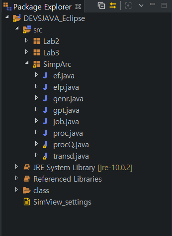
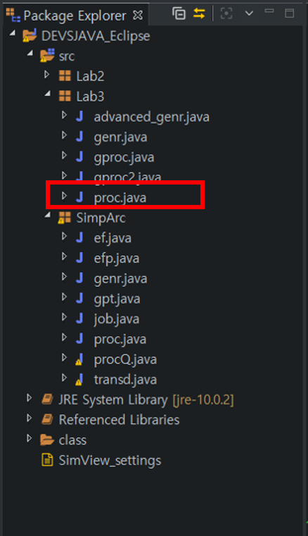
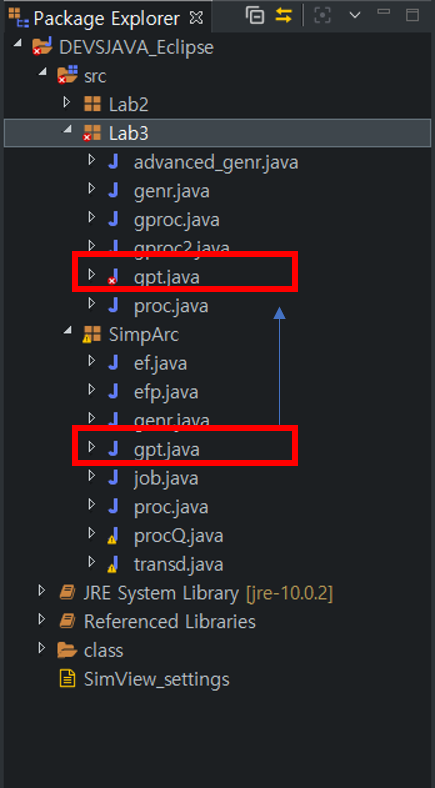
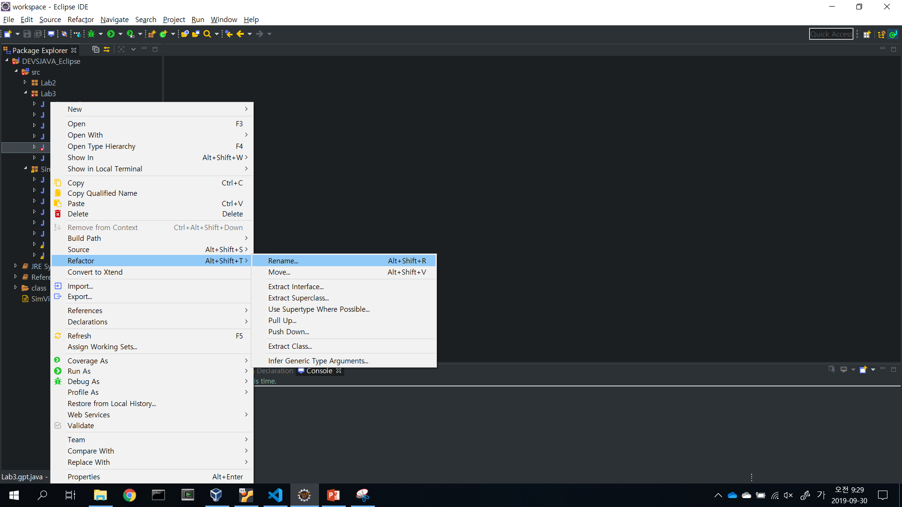
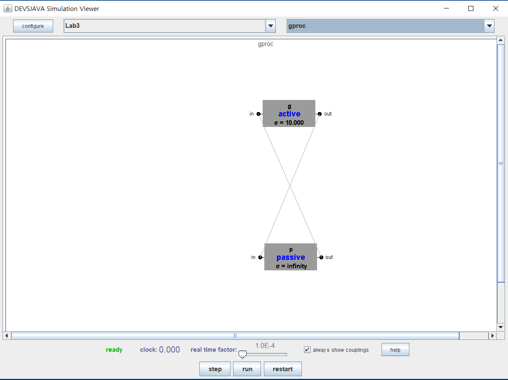

# 실습3

## digraph

2개 이상의 atomic model들이 결합한 형태

## processor atomic model

다음과 같은 특징이 있다.

- 주된 상태는 passive상태.
- Inport에서 job을 받아서 processing한 다음, Outport로 내보낸다.


## processor atomic model 실행 흐름

- External Transition Function  
inport로 job이 들어왔을 때
  - passive 상태라면 processing_time동안 busy 상태를 유지
  - busy 상태라면 해당 job을 무시하고 continue

- Internal Transition Function  
  - 만약 busy 상태라면 passive상태로 바꾸고 무한 대기

- Output Function  
External Transition Function에서 받은 job을 outport로 보내기

## processor 주요 코드

> proc.java

```java
public void deltext(double e, message x)
{
  Continue(e); // 멈추지 않은한 아래 코드 실행
  if (phaseIs("passive"))
  {
    for (int i = 0; i < x.getLength(); i++)
    {
      if(messageOnPort(x, "in", i))
      {
        job = x.getValOnPort("in", i);
        holdIn("busy", processing_time);
      }

    }
  }
}

public void deltint()
{
  // external에서 처리가 끝나면 output으로 이동, 다시 internal로 이동
  // phaseIs를 다시 passive상태로 전환시킨다.
  if (phaseIs("busy"))
  {
    job = new entity("");
    holdIn("passive", INFINITY);
  }


}

public message out()
{
  message m = new message();
  if(phaseIs("busy"))
  {
    // job은 위쪽 (external)에서 처리한 job이다.
    m.add(makeContent("out", job));
  }
  return m;
}
```

## digraph 생성코드

> gproc.java

```java
public gproc()
{
  super("gproc");

  ViewableAtomic g = new genr("g", 10);
  ViewableAtomic p = new proc("p", 10);

  add(g); // 실제로 화면에 추가하는 부분
  add(p);

  addCoupling(g, "out", p, "in"); // g의 out에서 p의 in으로 들어간다.
  addCoupling(p, "out", g, "in");
}
```

## 실습 내용

- 새로 Lab3 패키지 생성  

- Lab2에 있던 genr를 Lab3 패키지에 복사, proc 클래스 생성  

- 다음과 같이 코드 작성  

```java
package Lab3;
import genDevs.modeling.*;
import GenCol.*;
import simView.*;

public class proc extends ViewableAtomic
{
  protected entity job;
  protected double processing_time;

  public proc()
  {
    this("proc", 20);
  }

  public proc(String name, double Processing_time)
  {
    super(name);

    addInport("in");
    addOutport("out");

    processing_time = Processing_time;
  }

  public void initialize()
  {
    job = new entity();

    holdIn("passive", INFINITY);		// 외부에서 자극이 들어올때까지 passive 상태 유지
  }

  public void deltext(double e, message x)
  {
    Continue(e);						// 멈추지 않은한 아래 코드 실행
    if (phaseIs("passive"))
    {
      for (int i = 0; i < x.getLength(); i++)
      {
        if(messageOnPort(x, "in", i))
        {
          job = x.getValOnPort("in", i);

          holdIn("busy", processing_time);
        }

      }
    }
  }

  public void deltint()
  {
    // external에서 처리가 끝나면 output function으로 이동, 다시 internal로 이동
    // internal로 왔다는 것은 작업 처리가 끝났다는 의미이므로, phaseIs를 다시 passive상태로 전환시킨다.
    if (phaseIs("busy"))
    {
      job = new entity("");

      holdIn("passive", INFINITY);
    }
  }

  public message out()
  {
    message m = new message();
    if(phaseIs("busy"))
    {
      // job은 위쪽 (external)에서 처리한 job이다.
      m.add(makeContent("out", job));
    }
    return m;
  }

  public String getTooltipText()
  {
    return
    super.getTooltipText()
    + "\n" + "job: " + job.getName();
  }
}
```

- SimpArc 패키지에 있던 gpt클래스를 복사하여 Lab3에 포함시키기  

- gpt 이름을 gproc으로 고치기. 이클립스 리펙토링 이용  

- gproc에서 trasd에 대한 부분은 모두 제거하고 다음과 같이 코드 작성

```java
package Lab3;
import java.awt.*;
import simView.*;

public class gproc extends ViewableDigraph
{

  public gproc()
  {
    super("gproc");

    ViewableAtomic g = new genr("g", 10);	// int_arr_time, 안에서 어떻게 지정했던지 이렇게 된다.
    ViewableAtomic p = new proc("p", 10);	// process time

    add(g);	// 실제로 보여지는 부분
    add(p);

    addCoupling(g, "out", p, "in");		// g의 out에서 p의 in으로 들어간다.


    addCoupling(p, "out", g, "in");
  }

    /**
     * Automatically generated by the SimView program.
     * Do not edit this manually, as such changes will get overwritten.
     */
    public void layoutForSimView()
    {
        preferredSize = new Dimension(988, 646);
        ((ViewableComponent)withName("p")).setPreferredLocation(new Point(454, 388));
        ((ViewableComponent)withName("g")).setPreferredLocation(new Point(451, 116));
    }
}

```

- 프로젝트 실행 및 확인(configure 버튼으로 Lab3 패키지 포함시키기)  
