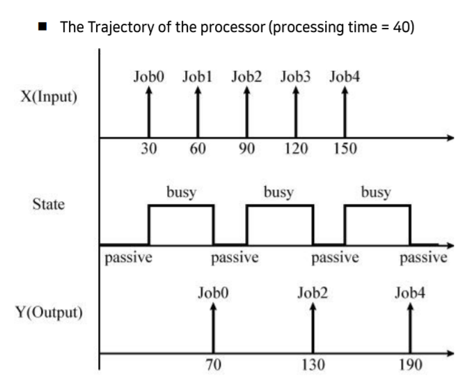

# 실습3

## digraph

2개 이상의 atomic model들이 결합한 형태

## processor atomic model

다음과 같은 특징이 있다.

- 주된 상태는 passive상태.
- Inport에서 job을 받아서 processing한 다음, Outport로 내보낸다.

## processor atomic model 실행 흐름

- External Transition Function  
inport로 job이 들어왔을 때
  - passive 상태라면 processing_time동안 busy 상태를 유지
  - busy 상태라면 해당 job을 무시하고 continue

- Internal Transition Function  
  - 만약 busy 상태라면 passive상태로 바꾸고 무한 대기

- Output Function  
External Transition Function에서 받은 job을 outport로 보내기
