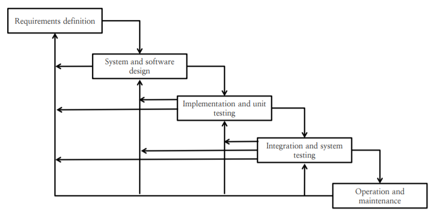

# Software Processes ans System Models

- Software process와 System Model이 무엇인지 알아보고, 왜 필요한지 알아본다.
- Process Model 중 하나인 Waterfall model에 대해서 알아본다.

## Software Process란

고품질의 소프트웨어를 정해진 시간내에 개발하기 위해서 거치는 일련의 단계(또는 phase)를 서술한 것이다.  
이러한 일련의 단계는 기획(planning), 요구사항 분석(requirement analysys), 설계 및 디자인(design), 코딩(coding), 테스트(test), 배포(deployment), 유지보수(maintenance)가 포함되어 있다.

- Process는 개발하려는 소프트웨어의 특성에 따라 달라질 수 있다.
- 요구사항 분석에는 기능적인 요구사항(functional requirement) 뿐만 아니라 비기능적인 요구사항(non-functional requirement)도 존재한다. 비기능적인 요구사항은 사용자(end user)가 사용하기 '편리'한지, 사용자 경험(UX)가 적절한지 등이 포함된다. 이는 평가하기 매우 어렵다. 비기능적인 요구사항에 의해서 프로그램의 성패가 갈리는 경우도 존재한다.
- 요구사항 분석이 어떤 기능(What)을 구현할지에 대해서 논의하는 것이라면, 설계 및 디자인은 해당 기능을 어떻게(How) 구현할 것인지에 대한 논의이다.

## System Model

시스템 모델(System model)은 시스템에 대한 개념적 단계(conceptual step)와 소프트웨어를 바라보는 관점에 대해서 함께 서술하는 개념이다.  
소프트웨어를 바라보는 관점은 소프트웨어의 구조와 행위, 입출력 등을 포함한다.

## Software Process와 System Model이 중요한이유

고품질의 소프트웨어를 기간내에 개발하는 것에 가이드라인을 제공한다. 소프트웨어 개발 행위들이 안정적이고 제어가능하며 조직적으로 수행될 수 있다.

## Process Model : Waterfall Model

- 요구사항 정의, 시스템 및 소프트웨어 디자인, 구현 및 단위 테스팅, 통합 및 시스템 테스팅, 실행 및 유지보수의 단계로 구성되어 있다.
- 각 단계가 끝나고 나서 다음 단계로 진행할 수 있다.
- 이전 단계에 대한 문제를 인식하면 해당 단계로 돌아가서 그 단계부터 다시 모든 단계를 거친다.

### 장점

- 사람의 실제 생활, 사람의 인식과정과 유사한 과정을 거치게 되므로 이해하기 쉽다.
- 각 단계가 명확이 구분되어 보기 쉽고, 프로젝트 매니저는 정해진 기한내에 해당 단계가 이루어졌는지 확인하면 되기 때문에 관리가 쉬워진다.
- 거대한 프로젝트를 진행할 경우, 요구사항을 명확히 정의한 뒤, 요구사항의 일정 부분들을 나누어서 여러 부서가 따로 개발할 수 있게 된다. 이러한 부서들은 서로 다른 지역에 위치하거나, 서로 다른 팀들이 될 수 있다.

### 단점

- 각 단계가 실제로 종료되었는지 확신하는 것이 어렵다.
- 사용자가 프로그램을 사용하기 위해서는 모든 단계가 종료될 때까지 기다려야한다.
- 새로운 요구사항이나 변경사항이 등장할 경우 이에 대처할 수 있는 방안이 명확하게 나타나지 않는다.(그냥 처음으로 돌아가는 정도)
- 실제 소프트웨어 개발은 폭포수 모델처럼 linear 하게 이루어지지 않는 경우가 대부분이다.
