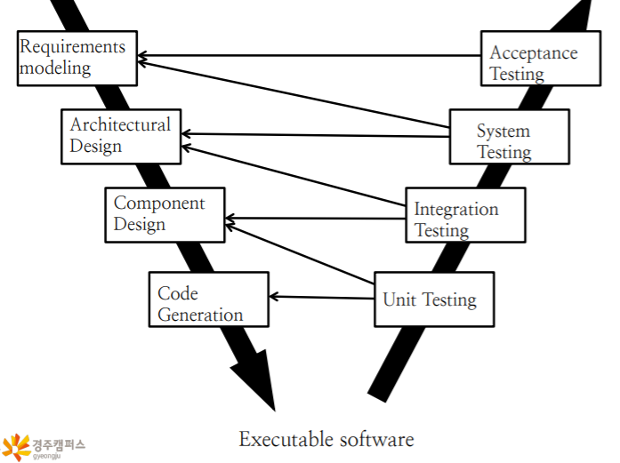
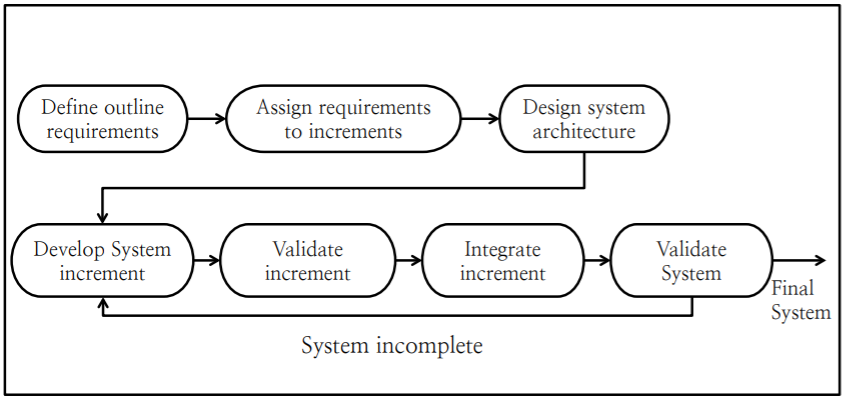
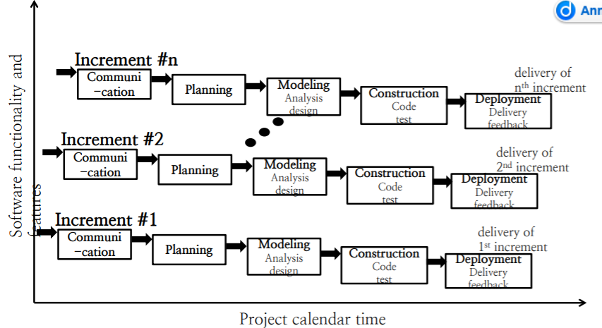
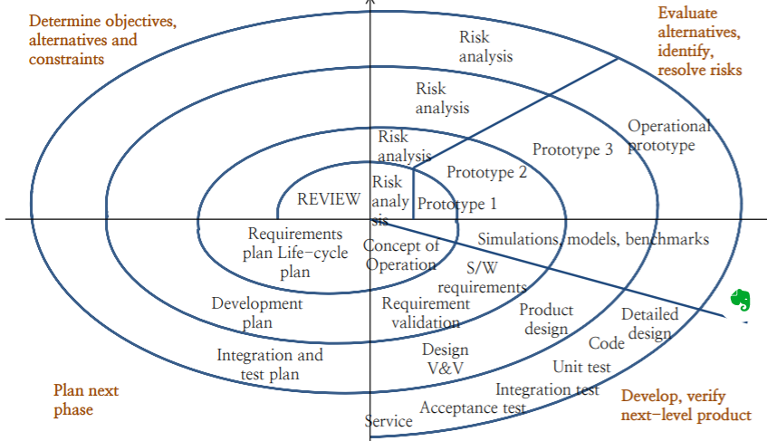
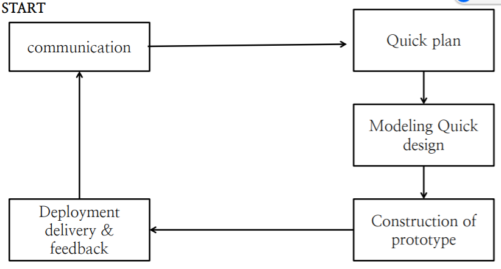

# Software Processes ans System Models

- Software process와 System Model이 무엇인지 알아보고, 왜 필요한지 알아본다.
- Process Model 중 하나인 Waterfall model에 대해서 알아본다.

## Software Process란

고품질의 소프트웨어를 정해진 시간내에 개발하기 위해서 거치는 일련의 단계(또는 phase)를 서술한 것이다.  
이러한 일련의 단계는 기획(planning), 요구사항 분석(requirement analysys), 설계 및 디자인(design), 코딩(coding), 테스트(test), 배포(deployment), 유지보수(maintenance)가 포함되어 있다.

- Process는 개발하려는 소프트웨어의 특성에 따라 달라질 수 있다.
- 요구사항 분석에는 기능적인 요구사항(functional requirement) 뿐만 아니라 비기능적인 요구사항(non-functional requirement)도 존재한다. 비기능적인 요구사항은 사용자(end user)가 사용하기 '편리'한지, 사용자 경험(UX)가 적절한지 등이 포함된다. 이는 평가하기 매우 어렵다. 비기능적인 요구사항에 의해서 프로그램의 성패가 갈리는 경우도 존재한다.
- 요구사항 분석이 어떤 기능(What)을 구현할지에 대해서 논의하는 것이라면, 설계 및 디자인은 해당 기능을 어떻게(How) 구현할 것인지에 대한 논의이다.

## System Model

시스템 모델(System model)은 시스템에 대한 개념적 단계(conceptual step)와 소프트웨어를 바라보는 관점에 대해서 함께 서술하는 개념이다.  
소프트웨어를 바라보는 관점은 소프트웨어의 구조와 행위, 입출력 등을 포함한다.

## Software Process와 System Model이 중요한이유

고품질의 소프트웨어를 기간내에 개발하는 것에 가이드라인을 제공한다. 소프트웨어 개발 행위들이 안정적이고 제어가능하며 조직적으로 수행될 수 있다.

## Process Model : Waterfall Model

- 요구사항 정의, 시스템 및 소프트웨어 디자인, 구현 및 단위 테스팅, 통합 및 시스템 테스팅, 실행 및 유지보수의 단계로 구성되어 있다.
- 각 단계가 끝나고 나서 다음 단계로 진행할 수 있다.
- 이전 단계에 대한 문제를 인식하면 해당 단계로 돌아가서 그 단계부터 다시 모든 단계를 거친다.

### 장점

- 사람의 실제 생활, 사람의 인식과정과 유사한 과정을 거치게 되므로 이해하기 쉽다.
- 각 단계가 명확이 구분되어 보기 쉽고, 프로젝트 매니저는 정해진 기한내에 해당 단계가 이루어졌는지 확인하면 되기 때문에 관리가 쉬워진다.
- 거대한 프로젝트를 진행할 경우, 요구사항을 명확히 정의한 뒤, 요구사항의 일정 부분들을 나누어서 여러 부서가 따로 개발할 수 있게 된다. 이러한 부서들은 서로 다른 지역에 위치하거나, 서로 다른 팀들이 될 수 있다.

### 단점

- 각 단계가 실제로 종료되었는지 확신하는 것이 어렵다.
- 사용자가 프로그램을 사용하기 위해서는 모든 단계가 종료될 때까지 기다려야한다.
- 새로운 요구사항이나 변경사항이 등장할 경우 이에 대처할 수 있는 방안이 명확하게 나타나지 않는다.(그냥 처음으로 돌아가는 정도)
- 실제 소프트웨어 개발은 폭포수 모델처럼 linear 하게 이루어지지 않는 경우가 대부분이다.

## Process Model : V-Model

Waterfall Model을 약간 변형한 모델이다. Waterfall Model에서 Quality assurance가 추가되고 강조된 형태이다. 요구사항 분석, 구조적 디자인, 컴포넌트 디자인, 코드 작성을 통해서 실행가능한 소프트웨어를 작성한뒤, 단위 테스팅, 통합 테스팅, 시스템 테스팅, Acceptance Testing을 통해서 품질 보증 과정을 거치게 된다. 각 테스팅 과정은 모든 phase에서 미리 준비되어 있어야한다. 다시 말하면 요구사항 분석 단계에서 미리 Acceptance Testing에 대한 준비가 이루어져야 하며, 구조 디자인에서는 시스템 Testing에 대한 준비가 이루어져야한다(and so on).

## Iterative Model : Incremental Model

폭포수 모델을 여러번 반복하여 소프트웨어를 개발하는 형태이다. 한 개발 과정을 거치면 그것에서 피드백을 얻고 다음 개발 과정을 진행하게 된다. 요구사항 분석, Architecture design, Component design은 한번만 수행하고, 코드 작성, 유닛 테스팅, 통합 테스팅과 같은 과정을 반복하는 형태이다.

### Incremental Model의 특징

- 사용자에게 제한된 기능만 존재하지만 핵심적인 기능은 갖춘 첫번째 소프트웨어를 빠르게 제공할 수 있다. 또한 사용자에게 피드백을 얻고 다음 개발 과정에서 활용할 수 있다.
- 프로젝트의 staff를 처음 개발과정에서는 작게 시작했다가, 이후에 인원을 추가하거나 줄이는 등의 유연한 대처가 가능하다.
- 소규모에서 중규모 프로젝트에 적합하다.
- 계속되는 반복에서 디자인이 안좋아질 수 있다.

## Evolutionary Model : Spiral Model

개발 목표, 제한조건 분석, 대안 분석 및 리스크 분석, 개발 및 검증, 다음 과정 계획 등의 과정들을 반복해나가면서 점진적으로 소프트웨어를 개발하는 방식. 초기 반복과정의 결과물은 프로토타입 형태이다가, 나중의 반복과정에서의 결과물들은 최종적인 소프트웨어가 된다. 큰 규모의 프로젝트에 적합하다. 프로젝트 중간에 요구되는 변경에 대해서 대처할 수 있다.

이 모델은 주로 리스크 관리에 의해서 프로세스가 진행되는 모델이다. 리스크에 대해서는 리스크를 대비하거나 회피할 수 있고, 회피할 수 없다면 피해를 최소화 할수도 있고, 리스크를 감당할 수 없다면 프로젝트를 폐기할 수도 있다. 리스크는 개발 능력 부족, 예산 부족, 사회 트렌드 등 여러 종류가 될 수 있다.

## Evolutionary Model : Prototyping model

프로토타입이란 사용자 입장에서 최종 결과물을 예측할 수 있게 해주는 중간단계의 모델이라고 할 수있다. 프로토타입은 사용자에게 최종 결과물에 대한 시각적 모델을 보여주고, 사용자로부터 소프트웨어에 대한 검증을 정확하게 받을 수 있다. 이러한 프로토타입을 통해서 사용자와 더욱 확실한 의사 소통 및 요구사항 분석이 가능해진다.

프로토타입 개발을 통해서 사용자(또는 Stakeholder)와의 원할하고 효율적인 의사소통이 가능하다. 사용자가 만족할 만한 프로토타입을 완성할 때까지 모델을 반복한다. 사용자가 만족하는 프로토타입이 완성되면 프로토타입은 폐기되고, 실제적인 소프트웨어가 개발되기 시작한다.

Prototyping Model은 그대로 소프트웨어 개발 프로세스로서 사용될 수도 있고, 다른 개발 프로세스에서 차용되어 사용자 요구분석 단계에서 사용될 수도 있다.
