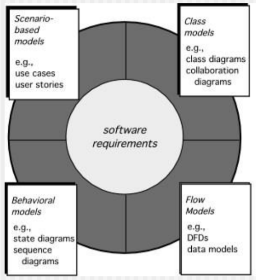
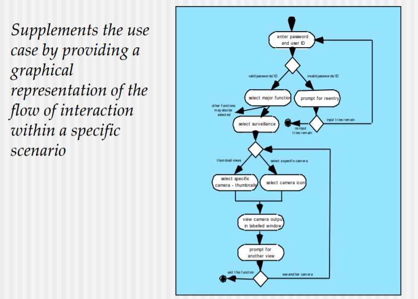
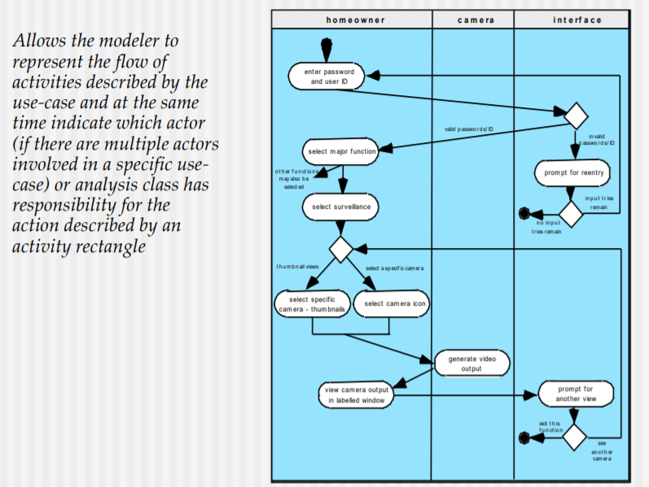

# Chaper09 Requirements Modeling : Scenario-Based Method

## Requirements Analysis

### Requirements analysis

- 소프트웨어의 동작의 특성을 명세한다.
- 다른 시스템과의 인터페이스를 분명히 한다.
  - 인터페이스 설계의 이유 : 각 시스템에서 사용하는 Data의 format, type이 다르다. 또한 다른 시스템간에 통신하는 protocol이 필요할 수 있다.
- 소프트웨어가 만족해야하는 제약사항들을 파악한다.

### Requirements analysis allow the software engineer to

- 초기 requirements engineering task에서 생성했던 기본 요구사항들을 상세히 설명한다.
- 유저 시나리오, functional activities, problem classes and their relationships, system and class behavior, flow ot data를 묘사하는 모델을 생성한다.

## Elements of Requirements Analysis

- Scenario-based models : 유저 입장에서는 구체적, 개발자 입장에서는 모호함.
- Class models : 좀 더 개발자 입장에 가까움. 하나의 Task를 하나의 class가 수행하거나, 여러 class가 협력하여 수행할 수도 있다. 또한 인스턴스화 된 객체들이 하나의 머신이 아니라 물리적으로 떨어진 여러개의 머신에 분산되어 있을 수도 있다.
- Behavioral models : object가 내부적으로 어떻게 행동할지를 명시한다. 내부 시스템의 상태에 따라서 이벤트의 영향(이벤트에 대해서 어떤 행동을 취할지)을 보여준다.
- Flow models : 데이터를 명시하고, 데이터의 흐름을 명시한다.

## Rules of Thumb

요구사항 분석단계에서 지켜야할 몇가지 지침들

- 모델은 아래쪽의 세부적인 기술 사항이 아니라 문제나 비즈니스 영역에서 보여질 수 있는 요구들에 집중해야한다. 이때 추상화의 level은 상대적으로 높다.
- 시스템의 coupling을 최소화해야한다. coulping은 데이터를 송수신할 수 있는 채널로 생각할 수 있다.
- 모델은 가능한 simple하게 유지하는 것이 좋다.

## Domain Analysis

- 조사할 Domain을 정의해야한다.
- 해당 도메인의 대표적인 샘플 application들을 모으고 조사한다.
- 해당 샘플의 application들을 분석한다.
- 객체들에 대한 analysis model을 개발한다.

## Scenario-Based Modeling

시스템 바깥의 actor와 system에서 어떤 일이 수행되어야 할지를 보여준다. Scenario-Based Modeling에서 해야하는 일들에는 다음과 같은 것들이 있다.

- 무엇을 작성하는가
- 얼만큼 작성하는가
- 얼마나 자세히 묘사해야 하는가
- 어떻게 설명들을 구성해야 하는가

### What to Write About

- Inception and elicitation : use cases를 작성하는데 필요한 정보들을 찾아낸다.
- 요구사항을 모으기 위한 meeting과 다른 Requirements engineering 방법들이 다음과 같은 이유들 때문에 수행된다.
  - 이해당사자들을 파악한다.
  - 문제의 영역을 정의한다.
  - 전반적인 동작의 목표를 정의한다
  - 우선순위를 매긴다
  - functional requirements 들의 윤곽을 잡는다.
  - 시스템에 의해서 조작되는 것들을 묘사한다.
- use cases를 개발하기 위해서는 먼저 특정한 actor에 의해서 실행되는 function 또는 activity들을 나열해본다.

### How Much to Write About

- stakeholder들과의 면담이 진행됨에 따라서 요구사항 수집 팀은 각 기능의 use case를 작성해나간다
- 일반적으로 처음에는 use case를 informal한 형태로 작성해나가기 시작한다.
- 후에 use case가 좀 더 formal 하게 되도록 요구된다면 좀 더 구조적인 형태로 다시 작성한다.

### Use-Cases

- scenario 는 시스템에 대한 사용 흐름을 묘사하는 것이다.
- actor는 시스템의 기능으로서 사람 또는 device의 역할을 묘사한다.
- user는 주어진 scenario에서 여러가지 역할을 수행할 수 있다.

## Exceptions

Exception은 생각지도 못한 behavior를 시스템이 나타내도록 하는 상황(동작의 실패 또는 user의 잘못된 선택)을 말한다.

## Activity Diagram

한 특정한 시나리오 안의 actor들간 상호 작용 및 동작의 흐름을 시각적으로 표현한 Diagram이다.

## Swimlane Diagram

Activity Diagram에서 각 actor들을 분할하여 어떤 동작이 누구에 의해서 실행되는지를 구분해서 보여줄 수 있는 Diagram이다.
