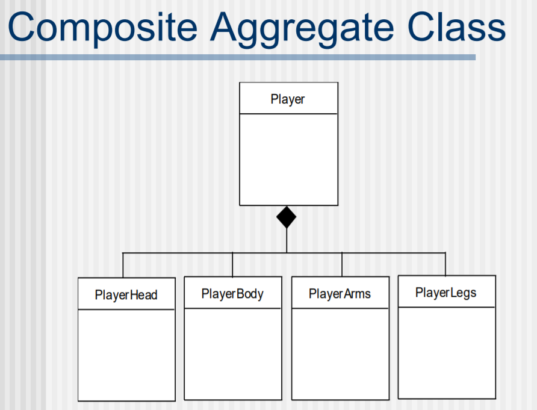
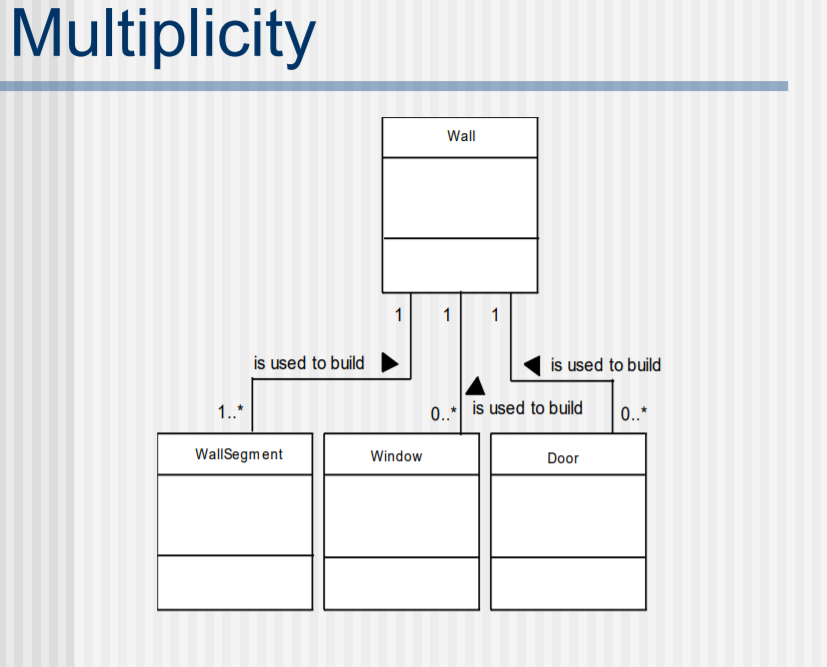
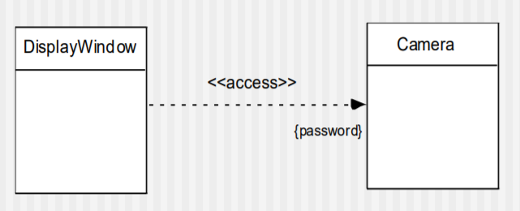

# Chaper10 Requirements Modeling : Class-Based Methods

## Class-Based Modeling

Class-Based 모델링이란

- system이 조작하는 object 들과
- manipulation 하기 위해서 수행하는 operation
- object들 간의 관계
- 정의된 클래스들 간의 collaboration

등의 관점으로 요구사항을 모델링 하는 것이다.

### Defining Attributes

attribute는 analysis model에서 포함되기로 선택된 클래스를 묘사하는 특성이다.

### Defining Operations

Operation은 다음과 같은 카테고리로 분류될 수 있다.

- data를 조작하는것
- 연산을 수행하는것
- object에 대한 상태를 조사하는 것
- 제어 event 발생에 대해서 작동하는 object들을 monitoring 하는것

> structure와 architecture : architecture는 객체들간의 구조와 구조 안에서 시스템에 대한 동작과 상태, 이들을 판단하는 object가 컨트롤하는 행동들을 모두 포함하는 개념이다.

### CRC Models

Class-Responsiblity-Collaborator(CRC) Modeling은 시스템 또는 제품의 요구사항과 관련된 클래스들을 인식하고 구조화하는 간단한 방법을 제공한다. CRC 모델은 클래스들을 표현하는 standard index card 들로 표현될 수 있다. 이 카드 위쪽에는 class의 이름이 적히고, 나머지 카드 부분의 왼쪽에는 class가 해야할 일들(responsiblity)가 적히며, 오른쪽에는 해당 일을 수행하기 위해서 협력해야 하는 다른 클래스(Collaborator)를 적는다.

### Collaborations

클래스들은 자신의 resonponsibility를 자신의 attribute와 operation을 통해서 스스로 해결할 수 있고, 다른 클래스와 collaborate 하여 해결할 수 있다. **collaboration**은 다른 클래스들간의 **관계(relationship)** 를 표현하기도 한다. 3가지 종류의 class간 relationship이 존재한다.

- is-part-of 관계 : 자동차의 부품들
- has-knowledge-of 관계
- depends-upon 관계 : 하나가 존재하려면 먼저 다른 것의 영향이 필요함

### Composite Aggregate Class

### Associations and Dependencies

2개의 analysis class들은 서로 어떤 방식으로 연관되어 질 수 있다. UML에서는 이런 관계를 **Association**이라고 한다. Association은 **multiplicity(Data modeling에서는 cardinality)** 를 통해서 정밀하게 표현될 수 있다.

많은 예에서 client-server 관계가 두 개의 클래스의 사이에 존재할 수 있다. 이런 관계에서 client 클래스는 server class에 depends on 한다고 하며 **dependency relationship**이 설립되었다고 할 수 있다.

## Analysis Packages

많은 analysis model에서의 element들은 그들을 그룹핑하는 package의 방법으로 분류된다. analysis class 앞에 붙은 + 기호는 다른 package에서도 쓰일 수 있는 class라는 뜻이다. - 기호는 다른 package에서 접근할 수 없는 클래스, # 기호는 주어진 package 내부에 포함된 package들에서만 접근 가능한 class를 뜻한다.

동일 package 간의 클래스들은 collaboration이 많으며, 다른 package간에는 interconection이 적다. 이런식으로 class들을 일정 단위로 묶으면 관리가 쉽다.
